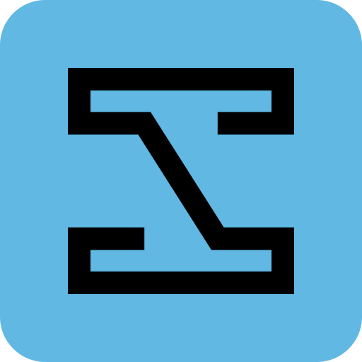

<!--
  The mark carries its own tile background, so a single asset renders correctly
  against GitHub's light and dark themes without a picture/prefers-color-scheme
  swap.
-->


# PDLC Studio

**A modern web interface for Claude Code CLI** — transform your command-line coding experience into an intuitive web-based chat interface.

<br clear="left" />

[](https://github.com/pdlc-os/pdlc-studio/actions/workflows/ci.yml)
[](https://github.com/pdlc-os/pdlc-studio/releases)
[](LICENSE)

PDLC Studio runs entirely on your machine. It drives the Claude Code CLI you already have installed and streams the results into a browser, so you keep the full capability of the CLI while gaining a readable, navigable interface you can use from any device on your network.

---

## Table of Contents

- [Why PDLC Studio](#why-pdlc-studio)
- [Quick Start](#quick-start)
  - [Prerequisites](#prerequisites)
  - [Option 1 — Binary Release](#option-1--binary-release)
  - [Option 2 — Development Mode](#option-2--development-mode)
- [CLI Options](#cli-options)
- [Environment Variables](#environment-variables)
- [Troubleshooting](#troubleshooting)
- [Development](#development)
- [Security Considerations](#security-considerations)
- [FAQ](#faq)
- [Contributing](#contributing)
- [License](#license)

---

## Why PDLC Studio

The Claude Code CLI is excellent at what it does, but a terminal constrains how you read and steer a session. PDLC Studio keeps the CLI as the engine and replaces only the interface.

|              | Claude Code CLI          | PDLC Studio                                                        |
| ------------ | ------------------------ | ------------------------------------------------------------------ |
| **Access**   | Terminal on one machine  | Any browser on your network                                        |
| **Device**   | Desktop-bound            | Desktop, tablet and phone                                          |
| **Output**   | Plain text               | Rendered Markdown, syntax-highlighted code, collapsible tool calls |
| **Projects** | `cd` between directories | Browse and pick any folder visually                                |
| **History**  | Scrollback               | Browse and restore previous sessions                               |

### Capabilities

- **Project launcher** — create a new project, clone a git repository, or open any existing directory
- **Real-time streaming** — responses render as Claude produces them
- **Conversation history** — browse and resume earlier sessions per project
- **Permission modes** — cycle `bypassPermissions`, `default`, `plan` and `acceptEdits` mid-session
- **Tool approval** — review and approve individual tool calls when prompts are enabled
- **Plan review** — inspect a proposed plan before allowing execution
- **Themes** — light and dark, following your system preference
- **Responsive layout** — touch-friendly down to phone widths

---

## Quick Start

### Prerequisites

| Requirement               | Binary release | Development mode |
| ------------------------- | :------------: | :--------------: |
| Claude CLI, authenticated |    Required    |     Required     |
| Modern browser            |    Required    |     Required     |
| Node.js >= 20             |       —        |     Required     |
| Deno                      |       —        |     Optional     |
| dotenvx                   |       —        |     Optional     |

The release binary is self-contained: it bundles the runtime and the web assets, so the Claude CLI and a browser are all you need.

Install the prerequisites with one command:

**macOS and Linux**

```bash
curl -fsSL https://raw.githubusercontent.com/pdlc-os/pdlc-studio/main/scripts/install-prerequisites.sh | bash
```

**Windows (PowerShell)**

```powershell
irm https://raw.githubusercontent.com/pdlc-os/pdlc-studio/main/scripts/install-prerequisites.ps1 | iex
```

The script installs the Claude CLI if it is missing and dotenvx if you want `.env` support. It **checks** for Node.js and Deno and prints the exact install command rather than installing them, because most developers manage those through a version manager (nvm, asdf, volta, fnm) and a second copy on `PATH` is a common source of the path-detection problems in [Troubleshooting](#troubleshooting). The script is safe to re-run; anything already present is left alone.

> [!NOTE]
> Run `claude` once after installing to authenticate. PDLC Studio uses your existing CLI login and never handles credentials itself.

### Option 1 — Binary Release

Self-contained executables are published for each release.

#### macOS

```bash
# Apple Silicon (M1 and later)
curl -fsSLO https://github.com/pdlc-os/pdlc-studio/releases/latest/download/pdlc-studio-macos-arm64
chmod +x pdlc-studio-macos-arm64

# Remove the download quarantine flag, then run
xattr -d com.apple.quarantine pdlc-studio-macos-arm64
./pdlc-studio-macos-arm64
```

On an Intel Mac, substitute `pdlc-studio-macos-x64` throughout.

> [!IMPORTANT]
> The binaries are not code-signed, so macOS quarantines them on download and Gatekeeper will refuse to run them until the flag above is cleared. Without `xattr -d`, you get "cannot be opened because the developer cannot be verified".

#### Windows

```powershell
# PowerShell
Invoke-WebRequest -Uri https://github.com/pdlc-os/pdlc-studio/releases/latest/download/pdlc-studio-windows-x64.exe -OutFile pdlc-studio.exe

# Clear the downloaded-file marker, then run
Unblock-File .\pdlc-studio.exe
.\pdlc-studio.exe
```

> [!IMPORTANT]
> SmartScreen may warn about an unrecognised publisher because the binaries are unsigned. `Unblock-File` clears the mark-of-the-web; if the warning still appears, choose **More info → Run anyway**.

#### Linux

```bash
curl -fsSLO https://github.com/pdlc-os/pdlc-studio/releases/latest/download/pdlc-studio-linux-x64
chmod +x pdlc-studio-linux-x64
./pdlc-studio-linux-x64
```

Use `pdlc-studio-linux-arm64` on ARM hardware.

Then open **http://localhost:8080**.

### Option 2 — Development Mode

```bash
git clone https://github.com/pdlc-os/pdlc-studio.git
cd pdlc-studio

# Install dependencies for both workspaces
make install

# Terminal 1 — backend on :8080
make dev-backend

# Terminal 2 — frontend on :3000
make dev-frontend
```

Then open **http://localhost:3000**. The frontend dev server proxies `/api` to the backend, so both need to be running.

`make dev-backend` uses Deno. To run the backend on Node.js instead:

```bash
cd backend && npm run dev
```

---

## CLI Options

| Option                 | Description                                                | Default     |
| ---------------------- | ---------------------------------------------------------- | ----------- |
| `-p, --port <port>`    | Port to listen on                                          | `8080`      |
| `--host <host>`        | Address to bind to                                         | `127.0.0.1` |
| `--claude-path <path>` | Path to the `claude` executable, overriding auto-detection | Auto-detect |
| `-d, --debug`          | Enable verbose debug logging                               | `false`     |
| `-v, --version`        | Print the version and exit                                 | —           |
| `-h, --help`           | Print help and exit                                        | —           |

```bash
# Defaults: http://127.0.0.1:8080
pdlc-studio

# Custom port
pdlc-studio --port 3000

# Bind to all interfaces, reachable from other devices on your network
pdlc-studio --host 0.0.0.0 --port 9000

# Verbose logging, including Claude CLI detection and raw SDK messages
pdlc-studio --debug

# Point at a specific Claude CLI, for version managers or wrapper scripts
pdlc-studio --claude-path "$(which claude)"
```

---

## Environment Variables

| Variable | Equivalent flag | Accepted values                  |
| -------- | --------------- | -------------------------------- |
| `PORT`   | `--port`        | Any valid port number            |
| `DEBUG`  | `--debug`       | `true` or `1` (case-insensitive) |

Command-line flags take precedence over environment variables.

```bash
# Inline
PORT=9000 DEBUG=true pdlc-studio

# From a .env file in the project root
echo "PORT=9000" > .env
dotenvx run --env-file=.env -- pdlc-studio
```

> [!NOTE]
> dotenvx is optional and used only to load a `.env` file into the process. Nothing in the application depends on it — exporting `PORT` directly works identically. The frontend dev server reads the root `.env` on its own through Vite.

---

## Troubleshooting

### "Claude Code process exited with code 1"

Almost always a Claude CLI path-detection failure. Point the server at your CLI explicitly:

```bash
pdlc-studio --claude-path "$(which claude)"
```

For version managers, resolve the real path first:

```bash
pdlc-studio --claude-path "$(volta which claude)"   # Volta
pdlc-studio --claude-path "$(asdf which claude)"    # asdf
```

### "Claude CLI script path detection failed"

A warning, not an error. The server traces `node` invocations to find the CLI's entry script; recent Claude Code releases ship a native binary that never invokes `node`, so the trace finds nothing and the server falls back to running the executable directly. This works correctly — the warning is informational.

### Sessions fail to start after upgrading

The SDK and the Claude CLI version independently. Compare them:

```bash
claude --version
```

against the `claudeCodeVersion` field in `backend/node_modules/@anthropic-ai/claude-agent-sdk/package.json`. A large gap between the two is worth ruling out before looking elsewhere.

### Port already in use

```bash
pdlc-studio --port 9000
```

### Getting more detail

```bash
pdlc-studio --debug
```

Debug mode logs CLI detection, the resolved executable path, and every raw SDK message.

---

## Development

### Setup

```bash
git clone https://github.com/pdlc-os/pdlc-studio.git
cd pdlc-studio
make install
```

Install the git hooks so quality checks run before each commit:

```bash
brew install lefthook   # or see https://github.com/evilmartians/lefthook
lefthook install
```

### Common tasks

| Command             | Description                                                                             |
| ------------------- | --------------------------------------------------------------------------------------- |
| `make dev-backend`  | Backend with hot reload on :8080                                                        |
| `make dev-frontend` | Frontend dev server on :3000                                                            |
| `make check`        | Everything below, plus a production build — this is what CI and the pre-commit hook run |
| `make format`       | Format both workspaces                                                                  |
| `make lint`         | Lint both workspaces                                                                    |
| `make typecheck`    | Type-check both workspaces                                                              |
| `make test`         | Run all tests                                                                           |
| `make build`        | Build the single-file binary                                                            |

> [!TIP]
> Run `make check` before pushing. It type-checks the test and demo fixtures through the frontend production build, which is stricter than `typecheck` alone and catches issues the individual targets miss.

### Layout

| Path               | Contents                                                                            |
| ------------------ | ----------------------------------------------------------------------------------- |
| `backend/`         | Hono server, Claude Agent SDK integration, runtime abstraction for Deno and Node.js |
| `frontend/`        | React + Vite application built on the Astryx design system                          |
| `shared/`          | TypeScript types shared across the wire                                             |
| `docs/.reference/` | Archived documentation and screenshots                                              |

Architecture notes, API reference and design decisions live in [CLAUDE.md](CLAUDE.md).

---

## Security Considerations

PDLC Studio executes the Claude Code CLI on your machine and exposes it over HTTP. Two defaults matter.

> [!CAUTION]
> **Permission prompts are disabled by default.** Sessions start in `bypassPermissions`, so Claude runs every tool — including shell commands via `Bash` — without asking for approval.
>
> **There is no authentication.** Combined with the above, anyone who can reach the port can run commands on your machine as you.

Keep the default `127.0.0.1` bind unless you have a specific reason not to, and put an authenticating proxy in front of the server before using `--host 0.0.0.0`. The server logs a warning at startup when it detects a non-loopback bind.

To require approval for each tool call, cycle the permission mode in the chat input footer or press <kbd>Ctrl</kbd>+<kbd>Shift</kbd>+<kbd>M</kbd>. To change the startup default, see "Permission Mode Switching" in [CLAUDE.md](CLAUDE.md).

| Usage                            | Assessment                                    |
| -------------------------------- | --------------------------------------------- |
| Local development on `127.0.0.1` | Recommended                                   |
| Trusted LAN via `--host 0.0.0.0` | Acceptable with care                          |
| Public internet                  | Not supported without an authenticating proxy |

Your code stays local. Nothing is transmitted anywhere except the API calls the Claude CLI already makes on your behalf.

---

## FAQ

<details>
<summary><strong>Do I need a Claude API key?</strong></summary>

No. PDLC Studio drives the Claude Code CLI, which uses whatever authentication you set up with `claude`. The application never sees or stores credentials.

</details>

<details>
<summary><strong>Can I use it from my phone?</strong></summary>

Yes. Start the server with `--host 0.0.0.0` and open `http://<your-machine-ip>:8080` from any device on the same network. Read [Security Considerations](#security-considerations) first — that flag removes the loopback-only protection.

</details>

<details>
<summary><strong>Is my code sent anywhere?</strong></summary>

No. Everything runs locally, and the only outbound traffic is the Claude API calls the CLI already makes.

</details>

<details>
<summary><strong>Can I deploy this to a server?</strong></summary>

It is designed for local and LAN use. There is no authentication, and permission prompts are off by default, so a public deployment requires an authenticating proxy in front of it at minimum.

</details>

<details>
<summary><strong>How do I update?</strong></summary>

Download the latest binary from [Releases](https://github.com/pdlc-os/pdlc-studio/releases), or `git pull && make install` in development mode.

</details>

<details>
<summary><strong>Deno or Node.js for the backend?</strong></summary>

Either. `make dev-backend` uses Deno and needs no dependency install; `cd backend && npm run dev` uses Node.js >= 20. Release binaries are compiled with Deno.

</details>

<details>
<summary><strong>Why does macOS refuse to open the binary?</strong></summary>

The binaries are unsigned, so macOS quarantines them. Clear the flag with `xattr -d com.apple.quarantine <binary>` — see [Option 1](#option-1--binary-release).

</details>

---

## Contributing

Contributions are welcome — bug reports, feature suggestions, documentation improvements and pull requests alike.

1. Fork the repository and create a branch from `main`
2. Set up your environment as described in [Development](#development)
3. Make your change, with tests where it makes sense
4. Run `make check` until it passes
5. Open a pull request describing what changed and why

Please open an issue before starting substantial work, so effort is not duplicated.

This project is written almost entirely by Claude Code. Pull requests from your own Claude Code sessions are very welcome.

---

## License

[MIT](LICENSE)
